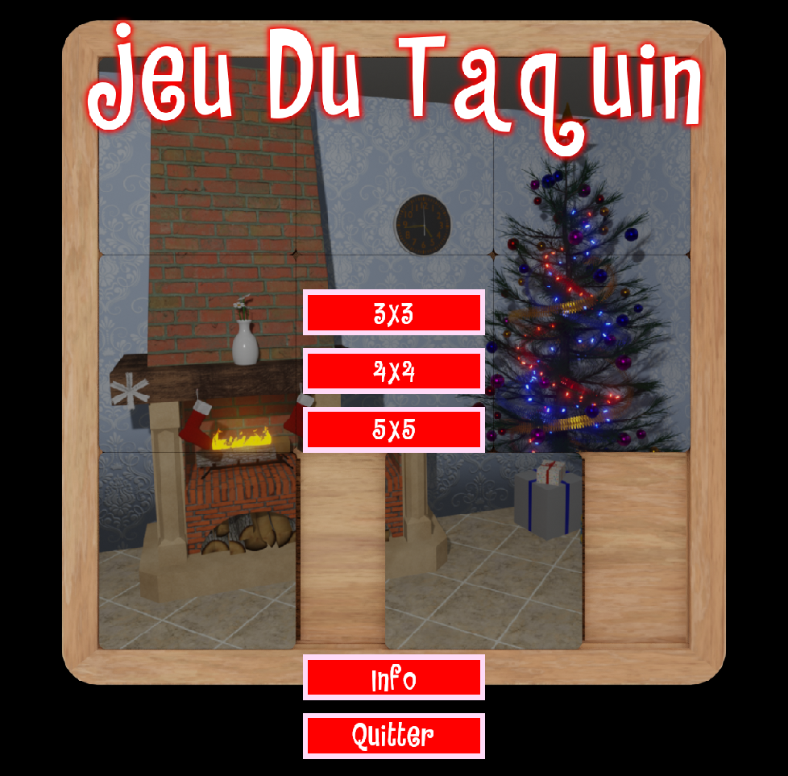
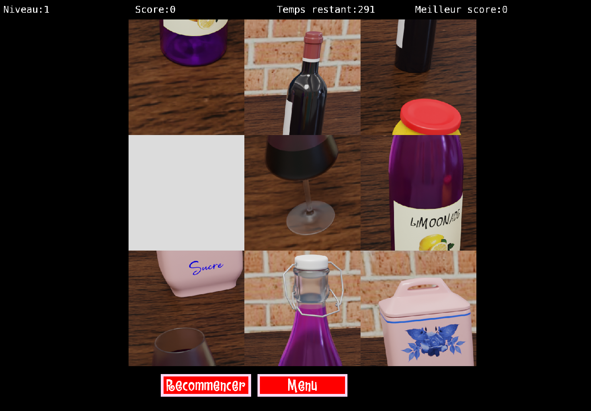

# Taquin

### Un simple jeu de puzzle écrit en c++/SFML
Gameplay: déplacez les pièces avec les flêches ou la souris


### A Simple Puzzle game writed in c++/SFML
Gameplay: arrow keys up,down,left,right or mouse 

### Compilation
You must install SFML(2.5) -dev lib.

```sh
$ git clone https://gitlab.com/Crabman77/taquin.git
$ cd taquin
$ g++ -o taquin Main.cpp Anim.cpp Button.cpp Card.cpp Engine.cpp Hud.cpp -lsfml-graphics -lsfml-window -lsfml-system -lsfml-audio -std=c++14
```
Launch
```sh
./taquin
```





